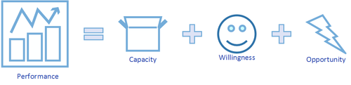
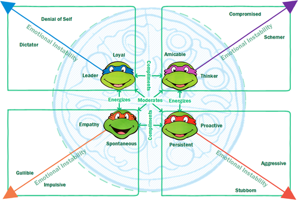

Title: Which Ninja Turtle Are You?
Date: 2018-12-08 21:00
Category: People
Tags: people, work, performance
Image: images/ninja_turtles/pizza_performance.png

Could personality be a reliable metric? Can it be an indicator of individual excellence? Is there an optimal mix of personalities for collaborative efforts? This was a question I investigated in an essay [“Individual and Group Software Developer Personalities”](http://issuu.com/ryancollingwood/docs/software_developers_personalities.d_582b37a634eadb) as part of an university assignment some years back. I keep revisiting this notion as personality is intertwined with concept of identity - which is an inescapable consequence of sentience[1](#1).

I decided to revisit the topic refocusing on the individual, well that and I have for the longest time asserted that if you wanted to get a feel for someone ask them, *“who's your favourite ninja turtle?”*[2](#2) To explain my rationale and how this could be operationalised for daily use, there is some background to cover. Or if you choose to skip the cerebral stuff[3](#3), then head to the Concerning Teenage Mutant Ninja Turtles section.

# Preferences
My understanding of personality and its use as a metric is that it can at best indicate preferences or tendencies rather than outright classification, this is acknowledged even by the developers of the commonly used Myers–Briggs Type Indicator[4](#4) (more on this later). Even then it can only be regarded as an appraisal of the current state, as personality and preferences change based on innumerable and often temporal factors[5](#5). Other research suggests that personality has modest effects on individual performance[6](#6). In addition the tools by which we frame our understanding are not without criticism stating they are subject to the “Forer Effect”  - that vague or general descriptions could evoke feelings of recognition of a classification, regardless of actual personality[7](#7).

Considering all of this does beg the question: why try to measure or specify it?

Performance and Personality
The aforementioned question is another matter entirely, however for the purposes of this discussion, let’s consider the following:

`Performance = Capacity + Willingness + Opportunity`[8](#8)

We could quibble about the arithmetic, but it is a reasonable to assume that a lack of capacity, willingness, or opportunity would adversely impact an individual’s ability to perform. Detailing the components as such:

Capacity is the education, motor skills, and health required to perform the task.
Willingness represents the attitudinal factors such as motivation, satisfaction and perceptions.
Opportunity details the tools, environment, leadership and time allocations.
With the above definitions, personality is a factor of the willingness dimension. I would also argue it is the dimension over which individuals have a marginal degree of influence compared to the others. While it is true that a turtle, no matter the enthusiasm or personal disposition to the martial arts, will not perform very well as a ninja. However, if it came into contact with otherworldly elixir and was fathered by rodent familiar with the arts (opportunity), it could then acquire the knowledge and attain a physical condition to do so (capacity).

Of course this example is hyperbole and no dimension is independent of another[9](#9), but I still argue that in our daily lives it is the willingness dimension where we make or break our successes[10](#10).

# Frameworks for Describing Personality
There are a number of frameworks for describing personality, and to dispute their relative validity is not my intention. The MBTI is particular well represented both in application and in research, and anyone who has encountered it will have an opinion about what their “type” is. It resonates with a penchant for filling in Buzzfeed like questionnaires and being awarded a non-threatening means of self identification[11](#11). The Keirsey Temperament Sorter[12](#12) builds upon the MBTI grouping its 16 possible outcomes into 4 subgroups, which themselves could be reconciled with the concept of Hippocrates’ four humours with some liberties.

Even the Five Factor Model of Personality is not with its detractors[13](#13), however I do believe it is notable in acknowledging that emotional state is not constant. It is of particular interest when studying work groups. Emotional Stability considers the tendency to express negative or non-constructive emotions, as such it is generally considered to be positively associated to group success[14](#14). Such expressions in a group setting will alter perceptions amongst the collective, regardless of accuracy. Perceptions inform action which in turn form our behaviours and routines[15](#15). It is not unreasonable to appreciate the potential detrimental effect a lack of Emotional Stability would have on the group.

# Concerning Teenage Mutant Ninja Turtles
Now that we have the background, let’s get to the important question; “which Ninja Turtle are you?” - keeping in mind these key points:

- Personality is about preferences.
- Preferences are not static.
- `Performance = Capacity + Willingness + Opportunity`
- Willingness is factor you can address at any time.
- If weren’t for other people, your personality wouldn’t matter as much[16](#16).
- Emotional Instability in a group setting can alter perceptions.
- Perception informs action.
- Actions form behaviours and routines.

Now if you’re unfamiliar with the “Teenage Mutant Ninja Turtles”[17](#17) aka TMNT, watch this video clip: 

[!embed](http://www.youtube.com/watch?v=mH8qFGcE1uQ)

For another view of TMNT, which covers a number of the concepts I’ve been discussing[18](#18): Which Ninja Turtle Are You? Life's Most Important Question

[!embed](http://www.youtube.com/watch?v=dtsmluPK7Ug)

The TMNT possess human like traits. They live and work together to thwart the schemes of villains like the Shredder. They are individually represented as having the following personality traits:

- **Leonardo**: As the defacto leader of the group, Leonardo often has to refocus the others on the task at hand. He is a very much a “by the book” character. Loyal to a fault.
- **Raphael**: Gets his hands dirty, never hesitant to do what needs to be done. Sometimes he acts without consulting others. He finds inaction frustrating, and can seem aloof.
- **Michelangelo**: Free spirited and empathetic. He is able to connect with others far more readily than his peers, although his good nature can be exploited by others.
- **Donatello**: The Thinker. He would rather resolve conflict through analysis. However he is prone to over thinking and over engineering, paralysis through analysis.

Being a primarily a show to market action figures to children (admittedly there is a gender bias towards boys in the marketing but I would put that down to the greater debate of conditioning and entrenched gender roles - perhaps a topic for another day), the level of emotional complexity and conflict is simple yet effective. Consulting my peers, acquaintances, or simply when I had nothing better to say to a stranger[19](#19) - I have found people identified with a specific turtle as it resonated with their identity as a child.

In the Turtles’ adventures, their success was dictated by careful balancing of their collective traits. The threat from villains was ultimately manageable, whereas keeping the harmony between the team was ultimately the source of real conflict. Their dominant traits while being a benefit to the collective, could just as easily be detrimental with increasing levels of emotional instability.

# Another Classification of Personality?
I’m not proposing we scrub the aforementioned tools for quantifying personality with four turtles who have hijacked the names of painters I am most likely to remember.

*I’m proposing a shift from classification to reflective identification.*

Going over the key points I raised earlier, I would brazenly and boldly assert[20](#20) that these measures do not serve the individuals they attempt to distill to category. Rather I would say: *“Which Ninja Turtle are you most like, in this moment?”*

What I’m proposing is to use a metaphor to describe how you feel, and recognise the strengths of how you identify in yourself at that moment. An attempt to operationalise these tools for daily use in a self diagnostic manner. While recognising the limitations of that avatar to which you feel aligned. If you’re burning with a desire to get things going, perhaps take a moment to consult your inner thinker - and if you cannot draw that out of yourself look for another who can be that for you. To illustrate I made the following graph:

# In Conclusion

So how to apply the above chart and stay within the pizza of performance?

- **When you’re tired or uninspired** - Seek out the turtle that energizes you, seek their viewpoint for alternative view that you may have overlooked.
- **When you recognise you’re in a negative headspace** - Seek out the turtle that moderates you. Be upfront with how you’re feeling and ask for their aid to get you back in the saddle.
- **When you need a friendly chat** - Seek your complimentary turtle. While different, these turtles are not too different and allowing for easy interactions.

While this isn’t the definitive guide to addressing “who are you” or “what you should be”, I do hope that it will provide an accessible and memorable means of diagnosing your current mental state.

## Go kick some shell!

<a name="1">[1]</a> I’m going to give humanity the benefit of the doubt. One can’t help if there isn’t some cut-off point for being classified as sentient.

<a name="2">[2]</a> This is a flawed test as it does assume the person you’re asking has a working knowledge of anthropomorphic martial artists. But even they don’t it’s a sure way to get a conversation going.

<a name="3">[3]</a> I’m guessing Donatello wasn’t your favourite?

<a name="4">[4]</a> Capretz L (2003), “Personality types in software engineering”, International journal of human-computer studies, Vol. 58, No.2, pp.207-214.

<a name="5">[5]</a> Danzigera S, Levavb J, Avnaim-Pessoa L 2011, "Extraneous Factors in Judicial Decisions”, Proceedings of the National Academy of Sciences, vol. 108, no. 17, pp. 6889-6892  

<a name="6">[6]</a> Hannay J, Arisholm E, Engvik H, Sjøberg D 2010, “Effects of Personality on Pair Programming.”, IEEE Transactions on Software Engineering, Vol.36, No.1, pp.61-80

<a name="7">[7]</a> Hannay J, Arisholm E, Engvik H, Sjøberg D 2010, “Effects of Personality on Pair Programming.”, IEEE Transactions on Software Engineering, Vol.36, No.1, pp.61-80

<a name="8">[8]</a> Feldt R, Angelis L, Torkar R, Samuelsson M 2010, “Links between the personalities, views and attitudes of software engineers”, Information and software technology, Vol.52, No.6, pp.611-624

<a name="9">[9]</a> For another example -  If you’re unwell and having a day away from work due to illness, it is unlikely that you’d perform at your place of employment (opportunity) very well no matter how knowledgeable (capacity) or eager you are to meet that deadline (willingness).

<a name="10">[10]</a> How many times have you had to do an actual “proper grown up” thing on the internet like research interest rates, and instead gone to youtube to watch cat videos. Personally speaking this isn’t an uncommon occurrence.

<a name="11">[11]</a> http://op-talk.blogs.nytimes.com/2014/07/18/why-myers-briggs-is-totally-useless-but-wildly-popular/?_r=0

<a name="12">[12]</a> http://www.keirsey.com/aboutkts2.aspx

<a name="13">[13]</a> McAdams D 1995, “What Do We Know When We Know a Person?”, Journal of Personality, Vol. 63, Issue 3, pp 365–396

<a name="14">[14]</a> Balijepally V, Mahapatra R, Nerur S 2006, “Assessing Personality Profiles of Software Developers in Agile Development Teams”, Communications of the Association for Information Systems, Vol. 18, No.4

<a name="15">[15]</a> Linberg K 1999, “Software developer perceptions about software project failure: a case study.”,  The Journal of systems and software, Vol. 49, No. 2-3, pp.177-192

<a name="16">[16]</a> *“L'enfer, c'est les autres”*, or *“Hell is other people.”* - Jean-Paul Sartre

<a name="17">[17]</a> I’m taking the 1987 cartoon adaptation as a frame of reference. While the original comics developed by Kevin Eastman and Peter Laird present more compelling character studies - the 1987 version is the more recognised form. Also the 1987 version didn’t have the handy colours to distinguish the turtles apart, so it makes visualising a bit more tricky.

<a name="18">[18]</a> Also get’s an honourable mention for being able to relate Sex and City to TMNT

<a name="19">[19]</a> You thought I was joking? It’s a legitimate question I pose to others. Along with “Who is Batman?”.

<a name="20">[20]</a> Why yes Raphael was my favourite Ninja Turtle as a child, what gave you that idea?
