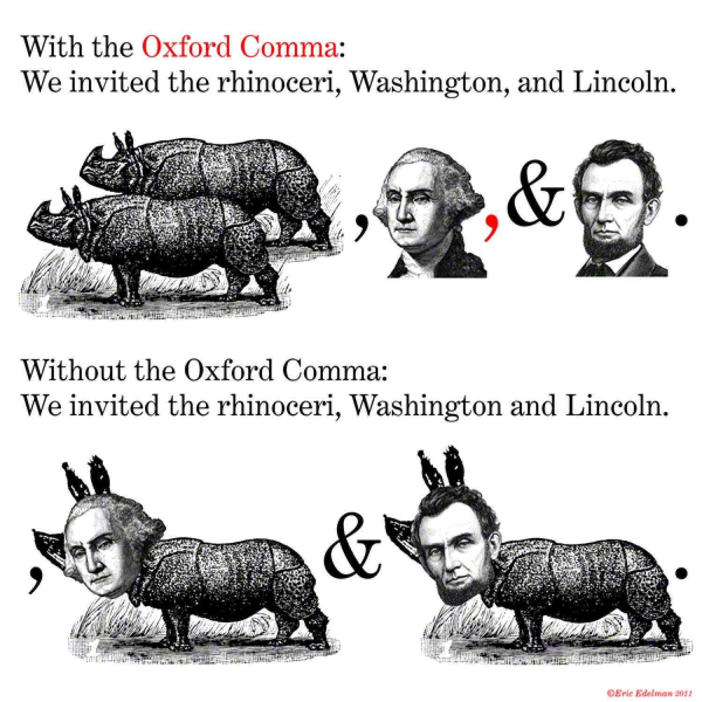

## Let's have some options

Pretend we're sign writers commissioned to write a menu of milkshake flavours. We've received our instructions on a note.

> *The flavours are Strawberry, Chocolate, Banana and Vanilla.* 

I try to not be a pendant about many things but the presence of an [Oxford Comma](https://en.wikipedia.org/wiki/Serial_comma) (aka. Serial Comma) in my experience creates clarity more-so than the absence thereof.

So we do our continue to write the sign as we understand the instructions.

> Milkshake Flavours:
> - Strawberry
> - Chocolate
> - Banana and Vanilla

So the milkshake shop owner receives the sign and is disappointed that the sign isn't what they expected. As there appear to be only three options on the sign:

> *The flavours are Strawberry, Chocolate, Banana, and Vanilla.*

We have to dispose of the sign we've crafted, returning to our workshop. This time we decide to take some initiative in rewriting the sign:

> Milkshake Flavours, choose one of:
> - Strawberry
> - Chocolate
> - Banana 
> - Vanilla

Again we present the sign to shop owner, who is even more upset. As now the sign reads as if it's not possible to half and half flavours.

So once more we put paint to board, and come up with:

> Milkshake Flavours, choose up to two of:
> - Strawberry
> - Chocolate
> - Banana 
> - Vanilla

## Implications

Now while this is a trite example, we can already see how a lack of specificity when detailing options can lead to inefficiency. Furthermore that our attempts to introduce specificity without validation lead to further disappointment.

But in a more complex context, where those tasked with implementing lack domain knowledge, these ambigiuities ...

## What have we learnt

- The articulation of intent informs the implementation, be it verbally or transcribed.
- I